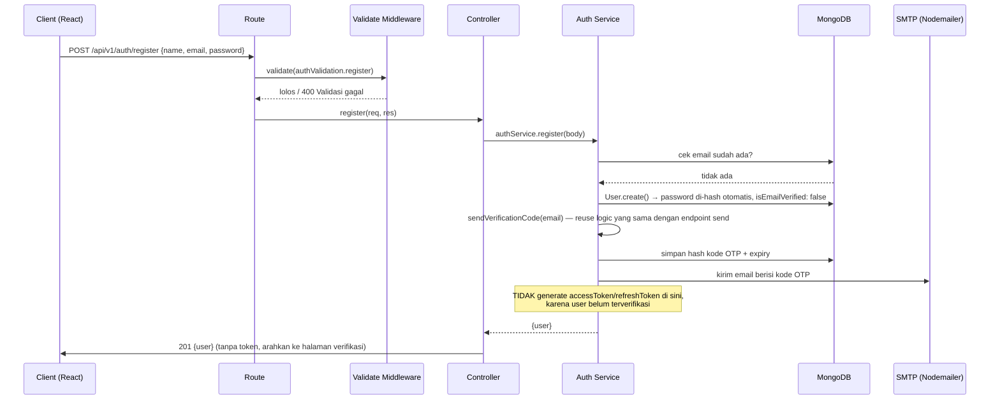
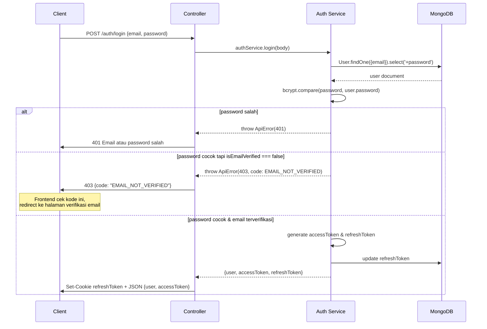
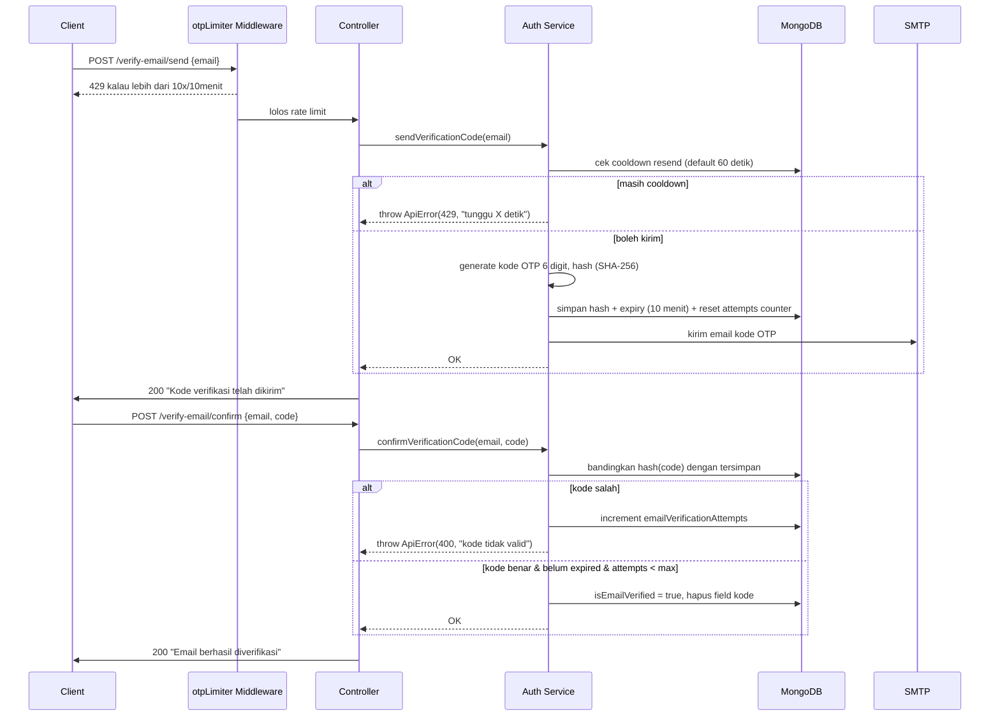
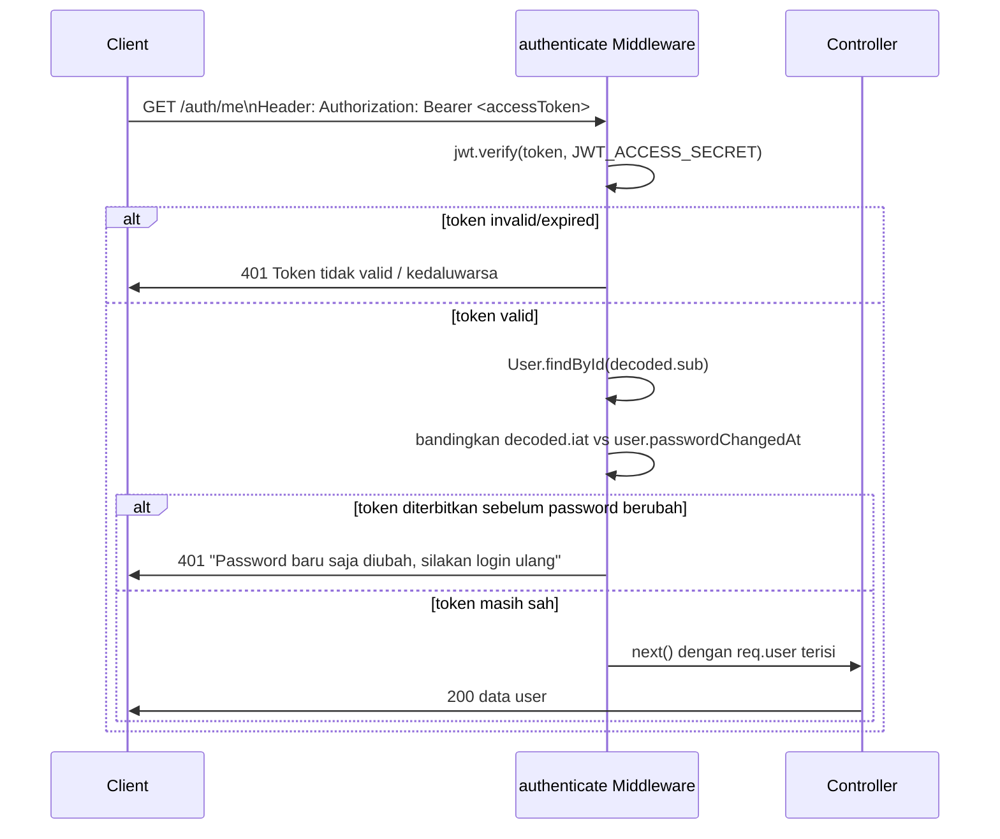
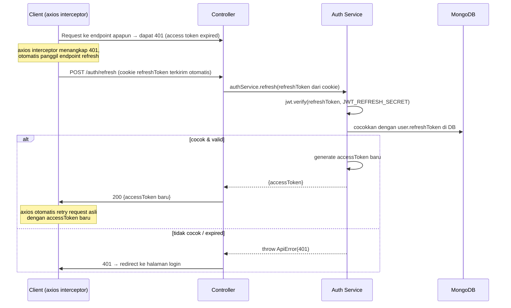
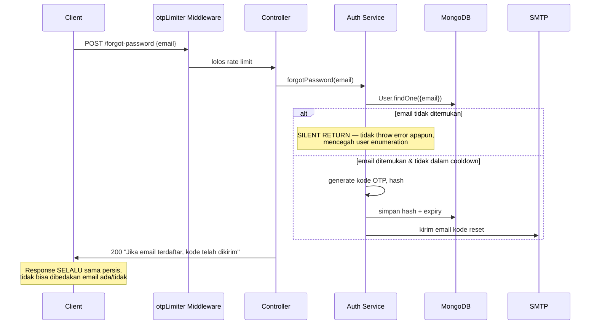
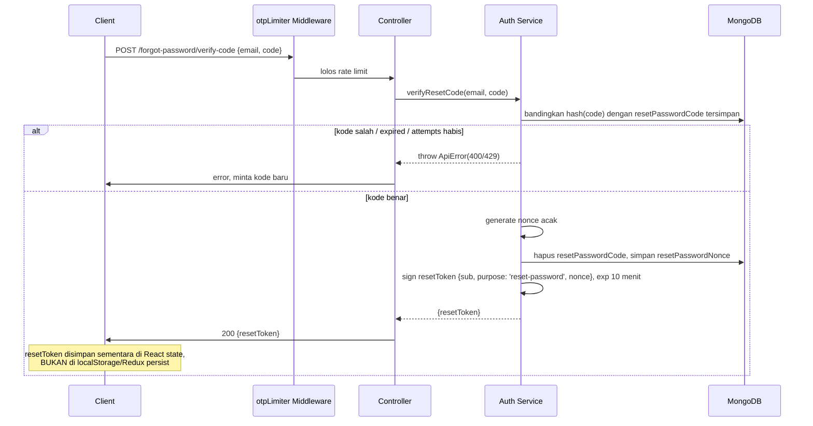
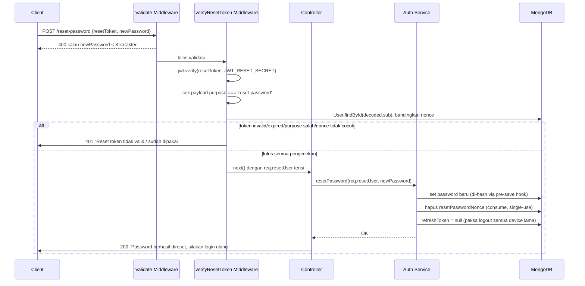
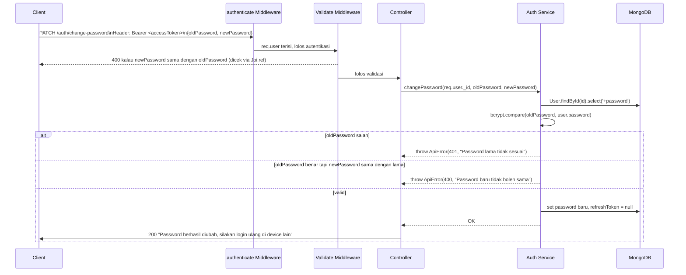
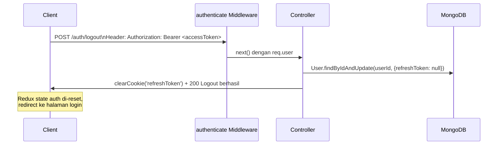

# Inventory Management

## 1. Tech Stack & Alasan Pemilihan

| Layer                 | Teknologi                       | Kenapa dipilih                                                               |
| --------------------- | ------------------------------- | ---------------------------------------------------------------------------- |
| Runtime               | Node.js + Express               | Standar industri untuk REST API, ekosistem besar                             |
| Database              | MongoDB + Mongoose              | Schema fleksibel, cocok untuk iterasi cepat capstone                         |
| Password hashing      | bcryptjs                        | Salted hash, tahan brute-force, standar industri                             |
| OTP hashing           | crypto (SHA-256, built-in Node) | OTP berumur pendek (menit), tidak perlu cost factor bcrypt yang berat        |
| Token                 | jsonwebtoken (JWT)              | Stateless, gampang di-scale (tidak perlu session store)                      |
| Pengiriman email      | Nodemailer + Gmail SMTP         | Gratis untuk skala capstone, App Password lebih aman dari password akun asli |
| Validasi input        | Joi                             | Deklaratif, error message rapi, dipisah dari logic                           |
| Security headers      | Helmet                          | Mencegah XSS, clickjacking, sniffing lewat header HTTP                       |
| Rate limiting         | express-rate-limit              | Mencegah brute-force login, OTP, & abuse endpoint                            |
| NoSQL injection guard | express-mongo-sanitize          | Membersihkan operator `$` dari input user                                    |
| Logging               | Winston + Morgan                | Log terstruktur, gampang di-debug di production                              |
| State management (FE) | Redux Toolkit                   | Predictable state, cocok untuk auth state global                             |

**Prinsip arsitektur:** `Route → Controller → Service → Model`

- **Route**: definisi endpoint + middleware yang dipasang
- **Controller**: terima `req`, panggil service, kirim `res` — tidak ada business logic
- **Service**: seluruh business logic, tidak tahu apa itu `req`/`res`, gampang di-unit-test
- **Model**: struktur data & aturan di level database (hashing password, dsb.)

---

## 2. Strategi Token: Kenapa Tiga Token?

Kita pakai **tiga jenis token**, bukan satu token dengan umur panjang. Ini best practice
industri karena menyeimbangkan **keamanan** dan **user experience** untuk kebutuhan yang
berbeda-beda.

| Token             | Umur                     | Disimpan di                                   | Tujuan                                                                                     |
| ----------------- | ------------------------ | --------------------------------------------- | ------------------------------------------------------------------------------------------ |
| **Access Token**  | Pendek (15 menit)        | Memory / state React (Redux)                  | Dipakai di header `Authorization: Bearer <token>` untuk akses endpoint terproteksi         |
| **Refresh Token** | Panjang (7 hari)         | httpOnly Cookie + DB (`user.refreshToken`)    | Dipakai khusus untuk minta access token baru, tidak pernah dikirim ke endpoint biasa       |
| **Reset Token**   | Sangat pendek (10 menit) | Dikirim di body request (bukan cookie/header) | Bukti "user sudah lolos verifikasi kode OTP", hanya valid untuk endpoint `/reset-password` |

**Kenapa access token umurnya pendek?**
Kalau token ini bocor (misal lewat XSS), penyerang cuma bisa pakai maksimal 15 menit.

**Kenapa refresh token disimpan di httpOnly cookie, bukan localStorage?**
`httpOnly` cookie tidak bisa diakses lewat JavaScript (`document.cookie`), jadi walaupun
ada celah XSS di frontend, refresh token tetap aman. Ini alasan utama kenapa kita **tidak**
simpan token apapun di `localStorage`.

**Kenapa refresh token juga disimpan di database (`user.refreshToken`)?**
Supaya kita bisa **mencabut (revoke)** akses kapan saja — misal saat user logout, ganti
password, atau akun dicurigai diretas, cukup hapus `refreshToken` di DB, maka refresh token
lama otomatis tidak valid lagi walau secara JWT belum expired.

**Kenapa `resetToken` dibuat terpisah dari access/refresh token?**
`resetToken` punya tujuan sangat spesifik dan sekali pakai: membuktikan bahwa pemilik
request sudah berhasil verifikasi kode OTP forgot-password. Dia sengaja **tidak** dipakai
sebagai token login karena:

- Signed dengan secret berbeda (`JWT_RESET_SECRET`), jadi tidak bisa dipakai untuk request
  ke endpoint protected lain — `authenticate` middleware akan menolaknya.
- Payload-nya menyimpan `purpose: 'reset-password'`, dicek eksplisit oleh middleware
  `verifyResetToken` supaya token ini benar-benar hanya bisa dipakai untuk aksi ini (token
  scoping).
- Bersifat **single-use**: begitu diterbitkan, sebuah `nonce` acak disimpan di
  `user.resetPasswordNonce`. Token hanya valid selama nonce di token cocok dengan nonce di
  DB — setelah dipakai sekali untuk reset password, nonce dihapus, jadi token yang sama
  tidak bisa dipakai ulang walau secara masa berlaku JWT belum habis.

**Bagaimana password yang berubah "mencabut" access token lama?**
Setiap kali password berubah (lewat reset-password maupun change-password), field
`passwordChangedAt` di-update. Middleware `authenticate` membandingkan `iat` (waktu terbit)
token dengan `passwordChangedAt` — kalau token diterbitkan _sebelum_ password berubah, token
itu ditolak meski belum expired secara teknis. Ditambah `refreshToken` di DB ikut di-clear,
sehingga user otomatis ter-logout dari semua device dan wajib login ulang.

---

## 3. Diagram Alur Lengkap

### 3.1 Register (kini otomatis kirim kode verifikasi)

### 3.2 Login (kini cek status verifikasi email)

### 3.3 Verifikasi Email (send == resend, satu endpoint)

### 3.4 Akses Endpoint Terproteksi (kini cek `passwordChangedAt`)

### 3.5 Refresh Token (saat access token expired)

### 3.6 Forgot Password — Langkah 1: Kirim Kode

### 3.7 Forgot Password — Langkah 2: Verifikasi Kode → Terbitkan `resetToken`

### 3.8 Forgot Password — Langkah 3: Reset Password dengan `resetToken`

### 3.9 Change Password (user sudah login)

### 3.10 Logout

---

## 4. Mapping Kode per Langkah

| Langkah                                   | File yang terlibat                                                                    |
| ----------------------------------------- | ------------------------------------------------------------------------------------- |
| Validasi input                            | `src/validations/auth.validation.js` → `src/middlewares/validate.middleware.js`       |
| Hash password otomatis                    | `src/models/user.model.js` (`pre('save')` hook, juga update `passwordChangedAt`)      |
| Generate token (access/refresh)           | `src/services/auth.service.js` (`generateAccessToken`, `generateRefreshToken`)        |
| Verifikasi token di endpoint terproteksi  | `src/middlewares/auth.middleware.js` (kini juga cek `passwordChangedAt`)              |
| Generate & hash kode OTP                  | `src/utils/otp.js`                                                                    |
| Kirim email (verifikasi & reset)          | `src/utils/mailer.js` (Nodemailer)                                                    |
| Rate limit khusus endpoint OTP            | `src/middlewares/otpLimiter.middleware.js`                                            |
| Verifikasi `resetToken` (purpose + nonce) | `src/middlewares/verifyResetToken.middleware.js`                                      |
| Logic verifikasi email                    | `src/services/auth.service.js` (`sendVerificationCode`, `confirmVerificationCode`)    |
| Logic forgot/reset password               | `src/services/auth.service.js` (`forgotPassword`, `verifyResetCode`, `resetPassword`) |
| Logic change password                     | `src/services/auth.service.js` (`changePassword`)                                     |
| Format response konsisten                 | `src/utils/ApiResponse.js`                                                            |
| Semua error (401/400/409/429/dst)         | `src/utils/ApiError.js` → ditangkap `src/middlewares/error.middleware.js`             |

---

## 5. Kenapa Ini "Scalable"?

1. **Stateless access token** → server tidak perlu simpan session di memory, jadi backend
   bisa di-scale horizontal (banyak instance) tanpa perlu sticky session atau shared session store.
2. **Service layer terpisah dari controller** → logic auth bisa di-reuse (misal dipanggil
   dari webhook atau CLI script) dan gampang di-unit-test tanpa perlu mock `req`/`res`.
3. **Refresh token per-user tersimpan di DB** → gampang ditambah fitur "logout dari semua
   device" atau "lihat device yang login" nanti, tinggal ubah `refreshToken` jadi array.
4. **Role-based authorization** (`authorize('admin')`) sudah siap dipakai untuk fitur
   admin-only tanpa restrukturisasi.
5. **Validasi & error handling terpusat** → menambah endpoint baru tidak menambah
   kompleksitas exponensial, semua endpoint baru tinggal ikut pola yang sama.
6. **Pola OTP & token scoping bisa dipakai ulang** → `resetToken` dengan `purpose` claim
   dan single-use nonce adalah pola generik. Kalau nanti butuh fitur lain yang mirip (misal
   "konfirmasi hapus akun", "undang anggota tim"), tinggal reuse pola yang sama tanpa
   desain ulang dari nol.

---

## 7. Dokumentasi Rute API

Semua endpoint berada di bawah prefix dasar: `/api/v1` (lihat `src/app.js`). Di bawah ini
ringkasan setiap grup rute yang tersedia di backend-dev.

Catatan singkat: banyak endpoint membutuhkan autentikasi (`authenticate` middleware).
Endpoint terkait OTP (verifikasi email / forgot password) menggunakan rate limit khusus
(`otpLimiter.middleware.js`). Reset password memakai mekanisme `resetToken` sekali-pakai
(`verifyResetToken.middleware.js`).

### 7.1 Auth (Autentikasi & Password)

- **POST /api/v1/auth/register**
    - Autentikasi: Tidak
    - Body: `{ name, email, password }` (divalidasi oleh `auth.validation.register`)
    - Respon: `201` user tanpa token (user perlu verifikasi email)
    - Catatan: Setelah register dikirim kode verifikasi via email.

- **POST /api/v1/auth/login**
    - Autentikasi: Tidak
    - Body: `{ email, password }`
    - Respon: `200` + `accessToken` (JSON) dan `refreshToken` diset sebagai httpOnly cookie
    - Catatan: Jika email belum diverifikasi akan mengembalikan `403` dengan code `EMAIL_NOT_VERIFIED`.

- **POST /api/v1/auth/verify-email/send**
    - Autentikasi: Tidak
    - Body: `{ email }`
    - Respon: `200` pesan bahwa kode dikirim
    - Catatan: Endpoint ini juga berfungsi sebagai "resend" dan dilindungi rate limiter.

- **POST /api/v1/auth/verify-email/confirm**
    - Autentikasi: Tidak
    - Body: `{ email, code }`
    - Respon: `200` jika verifikasi sukses

- **POST /api/v1/auth/forgot-password**
    - Autentikasi: Tidak
    - Body: `{ email }`
    - Respon: `200` selalu (silent return untuk mencegah user enumeration)
    - Catatan: Mengirim kode OTP ke email bila terdaftar.

- **POST /api/v1/auth/forgot-password/verify-code**
    - Autentikasi: Tidak
    - Body: `{ email, code }`
    - Respon: `200` + `{ resetToken }` (temporary token digunakan untuk reset password)
    - Catatan: Token ini harus disimpan sementara di state frontend, bukan di localStorage.

- **POST /api/v1/auth/reset-password**
    - Autentikasi: Tidak (menggunakan `verifyResetToken` middleware)
    - Body: `{ resetToken, newPassword }`
    - Respon: `200` jika password berhasil direset
    - Catatan: resetToken bersifat single-use; setelah reset semua `refreshToken` lama dihapus.

- **PATCH /api/v1/auth/change-password**
    - Autentikasi: Ya
    - Body: `{ oldPassword, newPassword }`
    - Respon: `200` jika berhasil (refreshToken dihapus untuk device lain)

- **POST /api/v1/auth/refresh**
    - Autentikasi: Tidak (menggunakan cookie httpOnly untuk refresh token)
    - Body: `{}` atau sesuai validasi
    - Respon: `200` + `{ accessToken }`

- **POST /api/v1/auth/logout**
    - Autentikasi: Ya
    - Respon: `200` + cookie `refreshToken` di-clear

- **GET /api/v1/auth/me**
    - Autentikasi: Ya
    - Respon: `200` data user (profil singkat)

Referensi implementasi: `src/routes/auth.routes.js` dan `src/services/auth.service.js`.

### 7.2 Menu

- **GET /api/v1/menu/**
    - Autentikasi: Ya
    - Query/Body: sesuai `menu.validation.getAllMenu` (paging/filter jika ada)
    - Respon: daftar menu (paging)

- **GET /api/v1/menu/:id**
    - Autentikasi: Ya
    - Params: `id` (menu id)
    - Respon: detail menu

- **POST /api/v1/menu/**
    - Autentikasi: Ya
    - Body: data menu sesuai `menu.validation.createMenu` (nama, harga, bahan, dsb.)
    - Respon: `201` menu baru

- **PUT /api/v1/menu/:id**
    - Autentikasi: Ya
    - Body: fields yang diizinkan di-update (lihat `menu.validation.updateMenu`)
    - Respon: `200` menu ter-update

- **DELETE /api/v1/menu/:id**
    - Autentikasi: Ya
    - Respon: `200` jika terhapus

Referensi implementasi: `src/routes/menu.routes.js`, `src/controllers/menu.controller.js`.

### 7.3 Inventory

- **GET /api/v1/inventory/**
    - Autentikasi: Ya
    - Query: filter/pagination sesuai `inventory.validation.getAllInventory`
    - Respon: daftar inventaris

- **GET /api/v1/inventory/options**
    - Autentikasi: Ya
    - Respon: daftar opsi singkat (mis. untuk dropdown)

- **GET /api/v1/inventory/:id**
    - Autentikasi: Ya
    - Respon: detail item inventaris

- **POST /api/v1/inventory/**
    - Autentikasi: Ya
    - Body: `{ name, unit, quantity, minStock, ... }` sesuai `inventory.validation.createInventory`
    - Respon: `201` item dibuat

- **PATCH /api/v1/inventory/:id**
    - Autentikasi: Ya
    - Body: fields yang boleh diupdate
    - Respon: `200` item ter-update

- **DELETE /api/v1/inventory/:id**
    - Autentikasi: Ya
    - Respon: `200` jika berhasil dihapus

Referensi implementasi: `src/routes/inventory.routes.js`, `src/controllers/inventory.controller.js`.

### 7.4 Planning

- **POST /api/v1/planning/**
    - Autentikasi: Ya
    - Body: data planning (lihat `planning.validation.createPlanning`)
    - Respon: `201` planning baru

- **GET /api/v1/planning/**
    - Autentikasi: Ya
    - Respon: daftar planning

- **GET /api/v1/planning/:id**
    - Autentikasi: Ya
    - Respon: detail planning

- **DELETE /api/v1/planning/:id**
    - Autentikasi: Ya
    - Respon: `200` jika dihapus

Referensi implementasi: `src/routes/planning.routes.js`, `src/controllers/planning.controller.js`.

### 7.5 Sales

- **GET /api/v1/sales/**
    - Autentikasi: Ya
    - Query: paging/filter sesuai `sales.validation.getSales`
    - Respon: daftar sales (transaksi)

- **GET /api/v1/sales/:id**
    - Autentikasi: Ya
    - Respon: detail sale

- **POST /api/v1/sales/**
    - Autentikasi: Ya
    - Body: data transaksi (items, total, payment, dsb.) sesuai `sales.validation.createSales`
    - Respon: `201` transaksi dibuat

Referensi implementasi: `src/routes/sales.routes.js`, `src/controllers/sales.controller.js`.

### 7.6 Dashboard

- **GET /api/v1/dashboard/summary**
    - Autentikasi: Ya
    - Respon: ringkasan metrik untuk dashboard (penjualan, stok, planning singkat)

Referensi implementasi: `src/routes/dashboard.routes.js`, `src/controllers/dashboard.controller.js`.

---

Jika Anda ingin agar dokumentasi ini lebih rinci (contoh payload lengkap, contoh response,
atau OpenAPI/Swagger spec), saya bisa:

- tambahkan payload contoh untuk tiap endpoint, atau
- generate berkas OpenAPI (YAML/JSON) berdasarkan route/validation yang ada.

Beritahu pilihan Anda dan saya akan lanjutkan.

---

## 8. Alur Detail Endpoint CRUD & Validasi (Joi)

Dokumen ini menjabarkan langkah-langkah request → validasi (Joi) → controller → service → response
untuk endpoint CRUD utama: `menu`, `inventory`, `planning`, dan `sales`. Setiap contoh response
menggunakan format helper `ApiResponse` (lihat `src/utils/ApiResponse.js`) yaitu:

{ success: boolean, message: string, data: any, meta?: object }

Catatan: semua contoh `id` adalah MongoDB ObjectId (24 hex chars).

### 8.1 Menu

- Endpoint: `POST /api/v1/menu` (Create)
    - Validasi (Joi - `menu.validation.createMenu`):
        - `name`: string, trim, 1-100, required
        - `description`: string, max 500, optional
        - `sellingPrice`: number, >=0, required
        - `ingredients`: array of at least 1 item, each item:
            - `inventoryId`: string, valid ObjectId, required
            - `quantityNeeded`: number, positive, required
    - Flow:
        1. `validate` middleware menjalankan Joi.
        2. Controller `createMenu` memanggil `menu.service.createMenu`.
        3. Service memeriksa duplikat `inventoryId`, memastikan semua `inventoryId` milik user.
        4. Buat `Menu` + `MenuIngredient` dalam transaction (atomic).
        5. Kembalikan objek menu yang telah dihitung `costPrice` & `profit`.
    - Contoh request body:
        {
            "name": "Nasi Goreng Spesial",
            "description": "Nasi goreng dengan telor dan ayam",
            "sellingPrice": 25000,
            "ingredients": [{ "inventoryId": "60a7...f1", "quantityNeeded": 200 }]
        }
    - Contoh success response (201):
        { "success": true, "message": "Menu created successfully", "data": { "id": "...", "name": "...", "sellingPrice": 25000, "costPrice": 12000, "profit": 13000, "ingredients": [...] } }
    - Error umum:
        - 400: validasi Joi gagal (pesan field spesifik)
        - 400: duplicate inventoryId / inventory not found
        - 409: nama menu sudah ada

- Endpoint: `GET /api/v1/menu` (List)
    - Validasi (`menu.validation.getAllMenu` query): `page` (int>=1), `limit` (1-100), `search` string, `sort` string
    - Flow: paginate, ambil ingredient batch, kembalikan `{ data: [...], meta }`.
    - Success (200): `{ success: true, message: 'Menu list retrieved successfully', data: { data: [...], meta: { page, limit, total } } }`

- Endpoint: `GET /api/v1/menu/:id` (Detail)
    - Validasi: `id` sebagai ObjectId (`menu.validation.menuId`)
    - Flow: cek kepemilikan user, ambil ingredients, hitung harga, return 200.
    - Error: 404 jika menu tidak ditemukan.

- Endpoint: `PUT /api/v1/menu/:id` (Update)
    - Validasi (`menu.validation.updateMenu`): `params.id` ObjectId, body minimal 1 field; `ingredients` sama schema.
    - Flow: cek menu milik user, jika `ingredients` disertakan lakukan validasi kepemilikan inventory,
        replace ingredient list (transaction), simpan perubahan.
    - Success (200): updated menu object.

- Endpoint: `DELETE /api/v1/menu/:id` (Delete)
    - Validasi: `id` ObjectId
    - Flow: cek menu milik user, cek apakah dipakai di `PlanningItem` — jika iya return 409,
        jika tidak hapus menu + ingredients dalam transaction.

### 8.2 Inventory

- Endpoint: `POST /api/v1/inventory` (Create)
    - Validasi (`inventory.validation.createInventory`):
        - `ingredientName`: string 2-100 required
        - `description`: string optional
        - `unit`: salah satu dari [gram, kg, ml, liter, pcs, piece]
        - `quantity`: number >=0 required
        - `unitCost`: number >=0 required
        - `validFrom`: date required
        - `validTo`: date > validFrom required
    - Flow: cek duplikat nama untuk user → create Inventory → return 201 with inventory data.
    - Success example (201): `{ success: true, message: 'Inventory created successfully.', data: { id, ingredientName, unit, quantity, unitCost, validFrom, validTo } }`
    - Errors:
        - 400: validasi Joi (mis. validTo <= validFrom)
        - 409: ingredient already exists

- Endpoint: `GET /api/v1/inventory` (List)
    - Validasi query: `page`, `limit`, `search`, `sort` (`inventory.validation.getAllInventory`)
    - Flow: paginate dan return `{ data, meta }`.

- Endpoint: `GET /api/v1/inventory/:id` (Detail)
    - Validasi: `inventoryId` ObjectId
    - Flow: find by id & userId, 404 jika tidak ada.

- Endpoint: `PATCH /api/v1/inventory/:id` (Update)
    - Validasi: `params.id` ObjectId, body minimal 1 field (`inventory.validation.updateInventory`), `validTo` dibandingkan dengan `validFrom` bila diberikan.
    - Flow: find inventory, assign payload, save, return updated object.

- Endpoint: `DELETE /api/v1/inventory/:id` (Delete)
    - Flow: cek exist & kepemilikan, cek apakah dipakai di `MenuIngredient` → jika dipakai return 409,
        jika tidak hapus dan return 200.

- Endpoint: `GET /api/v1/inventory/options` (Helper)
    - Flow: kembalikan daftar ringkas `{ ingredientName, unit, quantity }` untuk dropdown.

### 8.3 Planning

- Endpoint: `POST /api/v1/planning` (Create)
    - Validasi (`planning.validation.createPlanning`):
        - `name`: string 2-100 required
        - `startDate`: date required
        - `endDate`: date >= startDate required
        - `menus`: array (min 1) setiap item `{ menuId: ObjectId, quantity: integer >=1 }`
    - Flow:
        1. Joi validate.
        2. Service cek duplikat `menuId` dalam payload.
        3. Pastikan semua `menuId` ada dan milik user.
        4. Buat `Planning` + `PlanningItem` dalam transaction.
        5. Return 201 planning object.
    - Errors:
        - 400: duplicate menu id / missing fields
        - 404: salah satu `menuId` tidak ditemukan

- Endpoint: `GET /api/v1/planning` (List)
    - Flow: return semua planning milik user (sorted desc createdAt).

- Endpoint: `GET /api/v1/planning/:id` (Detail)
    - Flow: ambil planning, ambil `PlanningItem` + populate `menuId`, hitung `materials` via `materialCalculation.service`,
        return object: `{ planning: {id,name,startDate,endDate}, materials: [...] }`.
    - Error: 404 jika planning tidak ditemukan.

- Endpoint: `DELETE /api/v1/planning/:id` (Delete)
    - Flow: cek ownership, hapus planning + planning items di transaction.

### 8.4 Sales

- Endpoint: `POST /api/v1/sales` (Create / Record Transaction)
    - Validasi (`sales.validation.createSales`):
        - `items`: array min 1 of `{ menuId: ObjectId, quantitySold: integer >0 }`
        - Custom rule: tidak boleh ada duplicate `menuId` dalam `items` (gabungkan qty di frontend)
    - Flow:
        1. Ambil pricing map untuk semua `menuId` (`getMenuPricingMap`).
        2. Hitung kebutuhan inventory total (agregasi per `inventoryId`).
        3. Deduct stok secara atomik per inventory (cek `quantity >= amount` di update query).
             - Jika gagal karena stok tidak cukup → rollback semua perubahan stok yang sudah terjadi, return 409.
        4. Buat `Sale`, `SaleItem`, dan `StockMovement` records.
        5. Return 201 + full sale detail (items, stockMovements, totalProfit).
    - Success example (201): `{ success: true, message: 'Sale recorded successfully', data: { id, totalProfit, createdAt, items:[...], stockMovements:[...] } }`

- Endpoint: `GET /api/v1/sales` (List)
    - Validasi query (`sales.validation.getSales`): `startDate`, `endDate` (ISO), `page`, `limit`, `sort`.
    - Flow: paginate sales + attach items per sale.

- Endpoint: `GET /api/v1/sales/:id` (Detail)
    - Flow: ambil sale, sale items, stock movements → return detail.

---

Jika Anda ingin saya langsung menambahkan contoh payload & contoh response lengkap (400, 401, 404, 409)
untuk setiap endpoint secara otomatis ke `README.md`, saya bisa melakukannya — pilih antara:

- A: Tambah 1-2 contoh (success + validation error) per endpoint, atau
- B: Hasilkan file OpenAPI (YAML) lengkap yang dapat dipakai di Swagger UI.

Pilih A atau B (atau sebutkan kombinasi) dan saya akan lanjutkan.
7. **`send`/`resend` disatukan jadi satu endpoint** dengan cooldown di level service →
   mengurangi jumlah endpoint yang perlu di-maintain dan dites, tanpa mengorbankan fitur.

---

## 6. Yang Perlu Diperhatikan Frontend

### Auth dasar (login/register/refresh)

- Simpan `accessToken` **di Redux state saja** (in-memory), jangan di `localStorage`.
- Refresh token **otomatis terkirim** oleh browser lewat cookie, frontend tidak perlu
  pegang/kirim manual refresh token — cukup pastikan `withCredentials: true` di axios
  dan `credentials: 'include'` kalau pakai fetch.
- Pasang **axios response interceptor**: kalau dapat 401, panggil `/auth/refresh`,
  kalau berhasil retry request asli, kalau gagal redirect ke `/login`.
- Setelah refresh browser (F5), `accessToken` di Redux akan hilang (karena in-memory) —
  perlu mekanisme "silent refresh" saat aplikasi pertama kali load, dengan memanggil
  `/auth/refresh` sekali di awal untuk dapat access token baru dari refresh token cookie.

### Verifikasi email

- Setelah register sukses, langsung arahkan ke halaman "Masukkan kode verifikasi"
  (jangan ke dashboard, karena backend belum menerbitkan token login).
- Saat login mendapat response `403` dengan `code: "EMAIL_NOT_VERIFIED"`, redirect ke
  halaman verifikasi yang sama, boleh auto-trigger `POST /verify-email/send` sekali.
- Tombol "Kirim ulang kode" cukup panggil endpoint `send` yang sama (bukan endpoint
  terpisah) — tampilkan countdown di frontend mengikuti `OTP_RESEND_COOLDOWN_SECONDS`
  (default 60 detik) supaya user tidak spam klik sebelum backend menolak dengan 429.

### Forgot password (3 langkah, state di React saja)

- Buat 3 halaman/step dalam satu flow: input email → input kode OTP → input password baru.
- Simpan `resetToken` hasil dari langkah 2 di **state React lokal** (misal `useState` di
  komponen induk step, atau state management sementara), **jangan** simpan di
  `localStorage` atau Redux persist — umurnya cuma 10 menit dan sekali pakai.
- `resetToken` dikirim di **body** request ke `/reset-password`, bukan di header
  `Authorization`, karena bukan token login.
- Setelah reset-password sukses, jangan asumsikan user otomatis login — arahkan ke
  halaman login karena semua refresh token lama sudah di-invalidate backend.

### Change password (protected, beda dari forgot password)

- Endpoint ini butuh `accessToken` yang valid (halaman ini ada di dalam area yang sudah
  login, misal `/settings/security`).
- Setelah sukses, backend meng-clear `refreshToken` di DB — tampilkan pesan bahwa device
  lain akan otomatis ter-logout, lalu tetap biarkan user di device saat ini (access token
  yang sedang dipakai masih tervalidasi sampai expired 15 menit atau sampai axios
  interceptor melakukan refresh berikutnya, tergantung kapan `passwordChangedAt` dicek).
  Untuk UX yang paling aman & konsisten, disarankan tetap redirect ke halaman login supaya
  user langsung dapat access token baru yang bersih.
