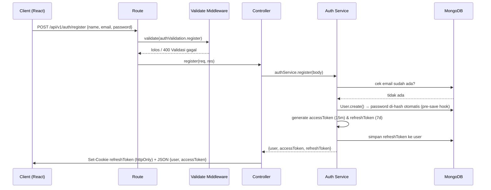
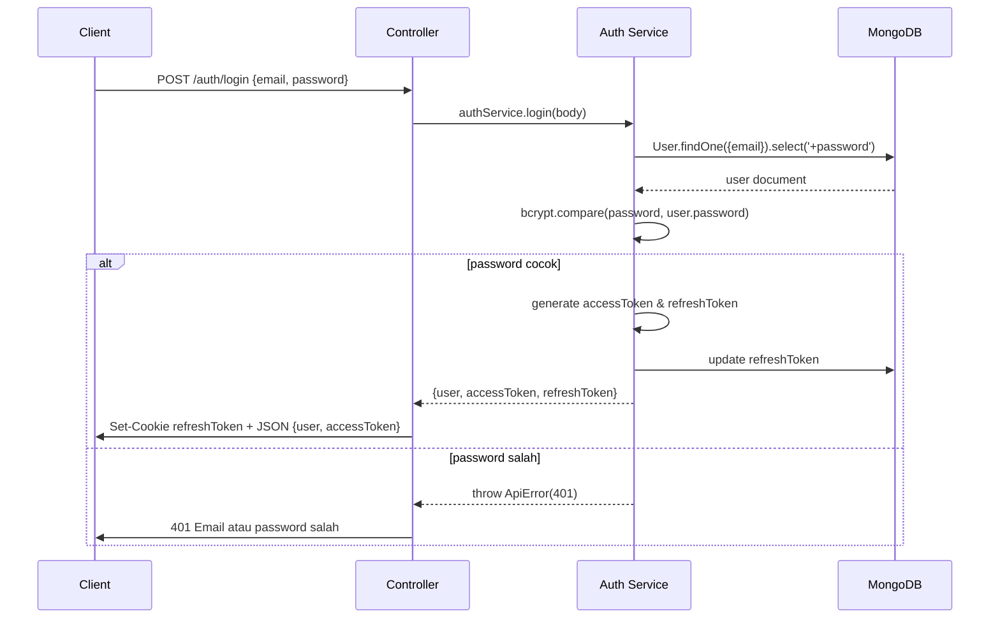
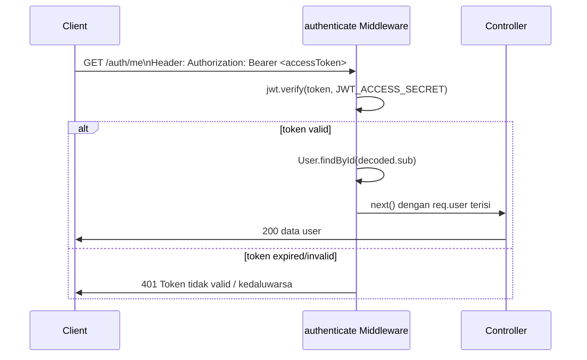
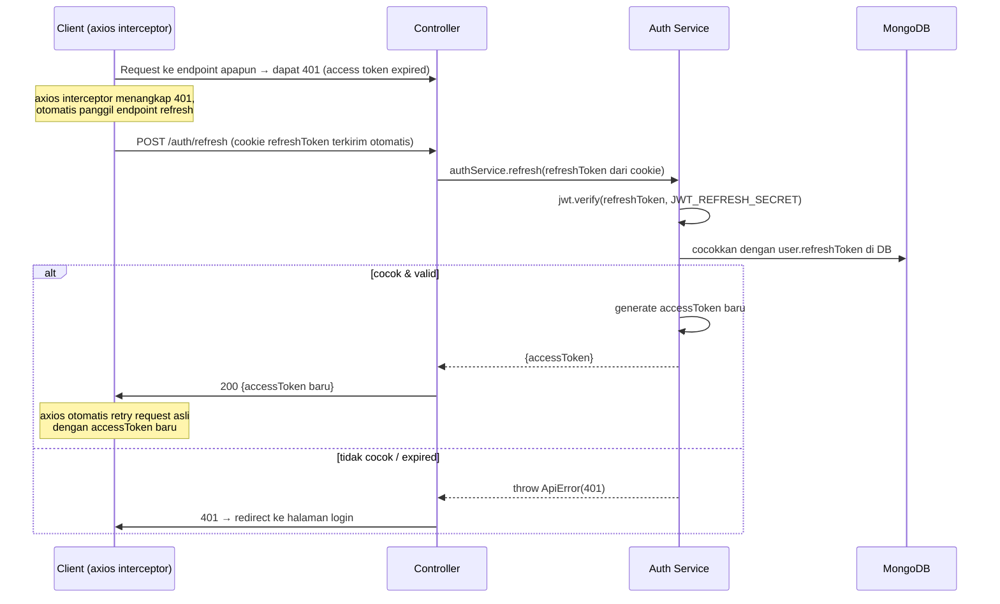
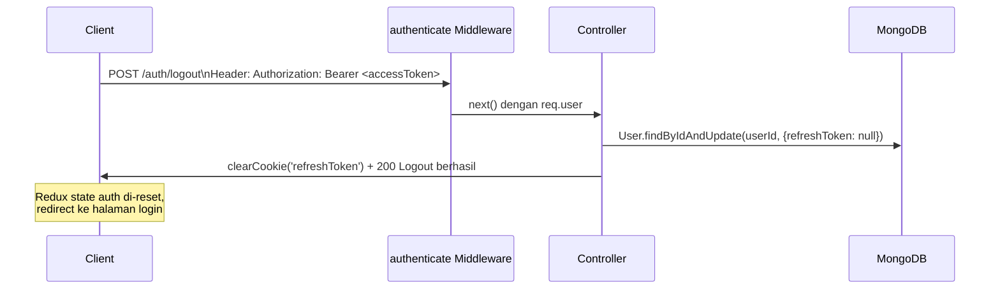

# Authentication Flow & Tech Stack — MERN Capstone

Dokumen ini menjelaskan **bagaimana dan mengapa** autentikasi di boilerplate ini dibuat
seperti sekarang, supaya tim (backend maupun frontend) punya pemahaman yang sama sebelum
mengembangkan fitur baru di atasnya.

---

## 1. Tech Stack & Alasan Pemilihan

| Layer                 | Teknologi              | Kenapa dipilih                                          |
| --------------------- | ---------------------- | ------------------------------------------------------- |
| Runtime               | Node.js + Express      | Standar industri untuk REST API, ekosistem besar        |
| Database              | MongoDB + Mongoose     | Schema fleksibel, cocok untuk iterasi cepat capstone    |
| Password hashing      | bcryptjs               | Salted hash, tahan brute-force, standar industri        |
| Token                 | jsonwebtoken (JWT)     | Stateless, gampang di-scale (tidak perlu session store) |
| Validasi input        | Joi                    | Deklaratif, error message rapi, dipisah dari logic      |
| Security headers      | Helmet                 | Mencegah XSS, clickjacking, sniffing lewat header HTTP  |
| Rate limiting         | express-rate-limit     | Mencegah brute-force login & abuse endpoint             |
| NoSQL injection guard | express-mongo-sanitize | Membersihkan operator `$` dari input user               |
| Logging               | Winston + Morgan       | Log terstruktur, gampang di-debug di production         |
| State management (FE) | Redux Toolkit          | Predictable state, cocok untuk auth state global        |

**Prinsip arsitektur:** `Route → Controller → Service → Model`

- **Route**: definisi endpoint + middleware yang dipasang
- **Controller**: terima `req`, panggil service, kirim `res` — tidak ada business logic
- **Service**: seluruh business logic, tidak tahu apa itu `req`/`res`, gampang di-unit-test
- **Model**: struktur data & aturan di level database (hashing password, dsb.)

---

## 2. Strategi Token: Kenapa Dua Token?

Kita pakai **dua jenis token**, bukan satu token dengan umur panjang. Ini best practice
industri karena menyeimbangkan **keamanan** dan **user experience**.

| Token             | Umur              | Disimpan di                  | Tujuan                                                                               |
| ----------------- | ----------------- | ---------------------------- | ------------------------------------------------------------------------------------ |
| **Access Token**  | Pendek (15 menit) | Memory / state React (Redux) | Dipakai di header `Authorization: Bearer <token>` untuk akses endpoint terproteksi   |
| **Refresh Token** | Panjang (7 hari)  | httpOnly Cookie              | Dipakai khusus untuk minta access token baru, tidak pernah dikirim ke endpoint biasa |

**Kenapa access token umurnya pendek?**
Kalau token ini bocor (misal lewat XSS), penyerang cuma bisa pakai maksimal 15 menit.

**Kenapa refresh token disimpan di httpOnly cookie, bukan localStorage?**
`httpOnly` cookie tidak bisa diakses lewat JavaScript (`document.cookie`), jadi walaupun
ada celah XSS di frontend, refresh token tetap aman. Ini alasan utama kenapa kita **tidak**
simpan token apapun di `localStorage`.

**Kenapa refresh token juga disimpan di database (`user.refreshToken`)?**
Supaya kita bisa **mencabut (revoke)** akses kapan saja — misal saat user logout atau akun
dicurigai diretas, cukup hapus `refreshToken` di DB, maka refresh token lama otomatis tidak
valid lagi walau secara JWT belum expired.

---

## 3. Diagram Alur Lengkap

### 3.1 Register

### 3.2 Login

### 3.3 Akses Endpoint Terproteksi

### 3.4 Refresh Token (saat access token expired)

Ini bagian yang paling sering di-skip di tutorial tapi **wajib ada** untuk aplikasi
production-ready, supaya user tidak perlu login ulang tiap 15 menit.

### 3.5 Logout

---

## 4. Mapping Kode per Langkah

| Langkah                                  | File yang terlibat                                                              |
| ---------------------------------------- | ------------------------------------------------------------------------------- |
| Validasi input                           | `src/validations/auth.validation.js` → `src/middlewares/validate.middleware.js` |
| Hash password otomatis                   | `src/models/user.model.js` (`pre('save')` hook)                                 |
| Generate token                           | `src/services/auth.service.js` (`generateAccessToken`, `generateRefreshToken`)  |
| Verifikasi token di endpoint terproteksi | `src/middlewares/auth.middleware.js`                                            |
| Format response konsisten                | `src/utils/ApiResponse.js`                                                      |
| Semua error (401/400/409/dst)            | `src/utils/ApiError.js` → ditangkap `src/middlewares/error.middleware.js`       |

---

## 5. Kenapa Ini "Scalable"?

1. **Stateless access token** → server tidak perlu simpan session di memory, jadi backend
   bisa di-scale horizontal (banyak instance) tanpa perlu sticky session atau shared session store.
2. **Service layer terpisah dari controller** → logic auth bisa di-reuse (misal dipanggil
   dari webhook atau CLI script) dan gampang di-unit-test tanpa perlu mock `req`/`res`.
3. **Refresh token per-user tersimpan di DB** → gampang ditambah fitur "logout dari semua
   device" atau "lihat device yang login" nanti, tinggal ubah `refreshToken` jadi array.
4. **Role-based authorization** (`authorize('admin')`) sudah siap dipakai untuk fitur
   admin-only tanpa restrukturisasi.
5. **Validasi & error handling terpusat** → menambah endpoint baru tidak menambah
   kompleksitas exponensial, semua endpoint baru tinggal ikut pola yang sama.

---

## 6. Yang Perlu Diperhatikan Frontend (Preview sebelum kita bangun boilerplate FE)

- Simpan `accessToken` **di Redux state saja** (in-memory), jangan di `localStorage`.
- Refresh token **otomatis terkirim** oleh browser lewat cookie, frontend tidak perlu
  pegang/kirim manual refresh token — cukup pastikan `withCredentials: true` di axios
  dan `credentials: 'include'` kalau pakai fetch.
- Pasang **axios response interceptor**: kalau dapat 401, panggil `/auth/refresh`,
  kalau berhasil retry request asli, kalau gagal redirect ke `/login`.
- Setelah refresh browser (F5), `accessToken` di Redux akan hilang (karena in-memory) —
  perlu mekanisme "silent refresh" saat aplikasi pertama kali load, dengan memanggil
  `/auth/refresh` sekali di awal untuk dapat access token baru dari refresh token cookie.
